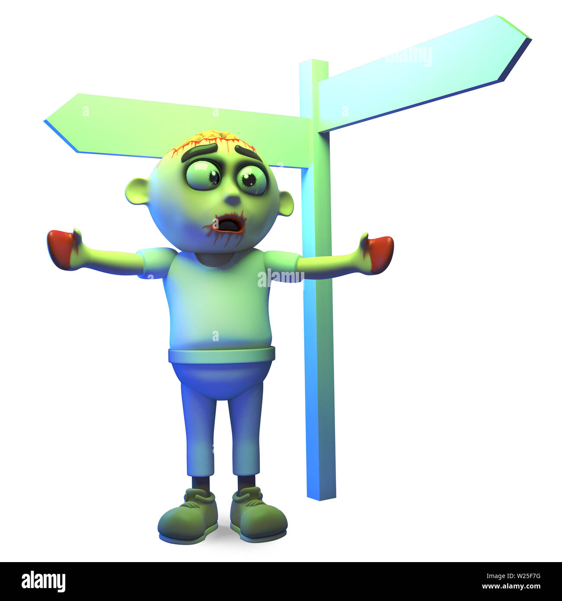

A l'aide les zombies nous attaques !

    

 Rule #2: Double Tap
Always check that the zombie is dead!
A second shot (ball, bat...) guarantees that he will not return.

🔪 Rule #1: Cardio
Run quickly, run well!
The first to die are always those who cannot run for long.

🧠 Rule #3: Avoid public toilets
One moment of inattention and you’re screwed!
Zombies love to surprise humans in moments of vulnerability.

🏡 Rule #4: Wear your belt
Accidents kill more than zombies.
A car crash at the wrong time = feast for the undead.

🔨 Rule #18: Be a Hero (Sometimes)
If you can help someone without sacrificing yourself, do it.
But do not play the hero useless, survival first.

🎢 Rule #31: Enjoy the little things
Even in the middle of an apocalypse, you have to know how to laugh and relax.
Perfect example: Looking for Twinkies like Tallahassee.

To avoid all this, it is better to wait like a good parent that our children finish their activities.
You can now defend yourself against zombies;}
The W program closes with ctrl+C, this allows you to observe 1 zombie.
The THW program simulates a zombie invasion " < defunct >"
_________________________________________________________________________________

 Règle #2 : Double Tap (Double Coup)
Vérifie toujours que le zombie est bien mort !
➜ Un deuxième coup (balle, coup de batte...) garantit qu'il ne reviendra pas.

🔪 Règle #1 : Cardio
Fuis vite, fuis bien !
➜ Les premiers à mourir sont toujours ceux qui ne peuvent pas courir longtemps.

🧠 Règle #3 : Évite les toilettes publiques
Un moment d’inattention et tu es foutu !
➜ Les zombies adorent surprendre les humains dans les moments de vulnérabilité.

🏡 Règle #4 : Portez votre ceinture
Les accidents bêtes tuent plus que les zombies.
➜ Un crash de voiture au mauvais moment = festin pour les morts-vivants.

🔨 Règle #18 : Soyez un héros (Parfois)
Si tu peux aider quelqu'un sans te sacrifier, fais-le.
➜ Mais ne joue pas les héros inutiles, la survie d'abord.

🎢 Règle #31 : Profitez des petites choses
Même en pleine apocalypse, il faut savoir rire et se détendre.
➜ Exemple parfait : Chercher des Twinkies comme Tallahassee.

Pour éviter tout ça, mieux vaut attendre comme un bon parent que nos enfants finissent leurs activités.
Vous pouvez désormais vous défendre contre les zombies ;}
Le programme W se ferme avec ctrl+C, cela vous permet d'observer 1 zombie.
Le programme THW simule une invasion de zombies " < defunct >"
