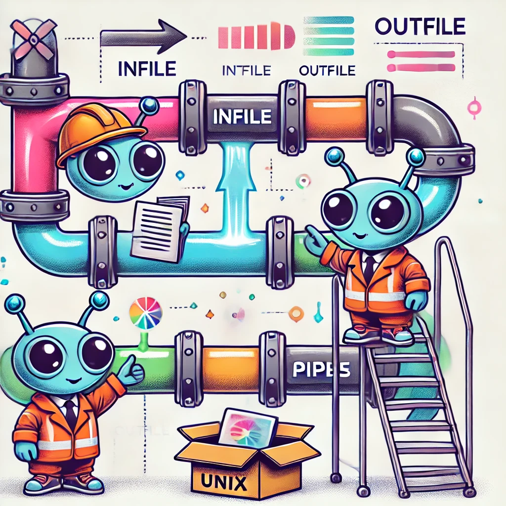
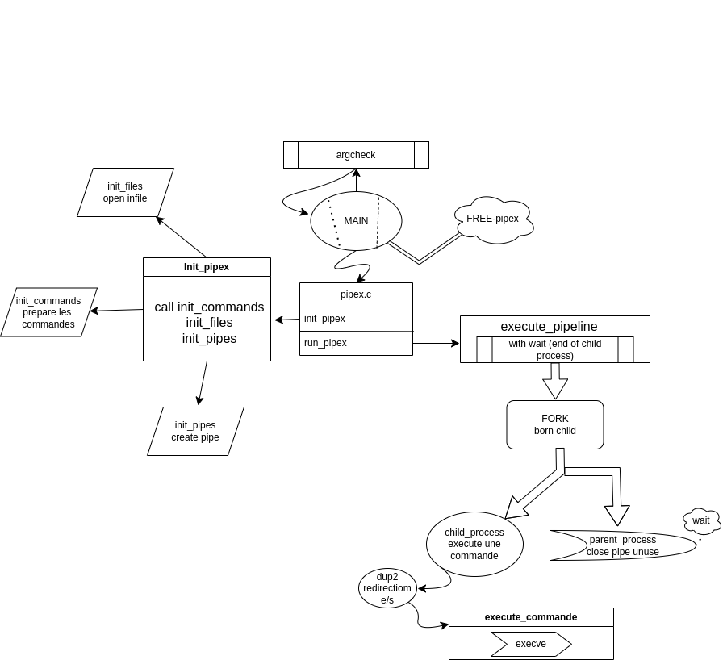

# Voici le pipex sur lequel j'ai cassé ma pipe 🚀

    

---
Pipex is my/pipes project

An AI-powered small course is available to better understand the topic and code.

How to kill a zombie effectively is a question we have all already asked?

The testers come from other GitHub and their references are in their README.
_______________________________________________________________________________________

Pipex est mon /pipes project

Un petit cours optimisé par les IA est disponible pour mieux cerner le sujet et le code.

Comment tuer un zombie efficacement est une question que l'on s'est tous déjà posée ?

Les testeurs proviennent d'autres GitHub et leurs références sont dans leurs README.

    

